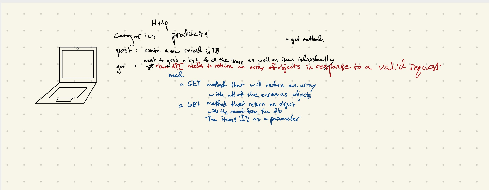

# LAB - 08

## Api Server

### Author: Chris Bortel

### Pull requests

- [Class-06](https://github.com/Chris-Bortel-401-advanced-javascript/api-server/pull/1)
- [Class-07](https://github.com/Chris-Bortel-401-advanced-javascript/api-server/pull/3)
- [Class-08](https://github.com/Chris-Bortel-401-advanced-javascript/api-server/pull/5)
- [Class-09](https://github.com/Chris-Bortel-401-advanced-javascript/api-server/pull/7)

### Swagger Docs

- **I need to update my swagger docs**
- [Categories](https://app.swaggerhub.com/apis/bortelcc/categories-api/0.1#/default/put_categories_2)
- [Products](https://app.swaggerhub.com/apis/bortelcc/products-api/0.1#/default/put_products_8)

### Setup

- Install the dependencies

#### `.env` requirements

- `PORT`=3000
<!-- - Do I need routes here? -->
- [Heroku Deployment](https://api-server-cb.herokuapp.com/api/v2/products)

#### Running the app

- Run `npm start` to spin the server up

<!-- - To start the json server run: ``» json-server --watch ./data/db.json`` -->

#### Questions

- with my post route, I am able to add onto my count, but I am unable to add it into my object

#### Tests

#### UML

